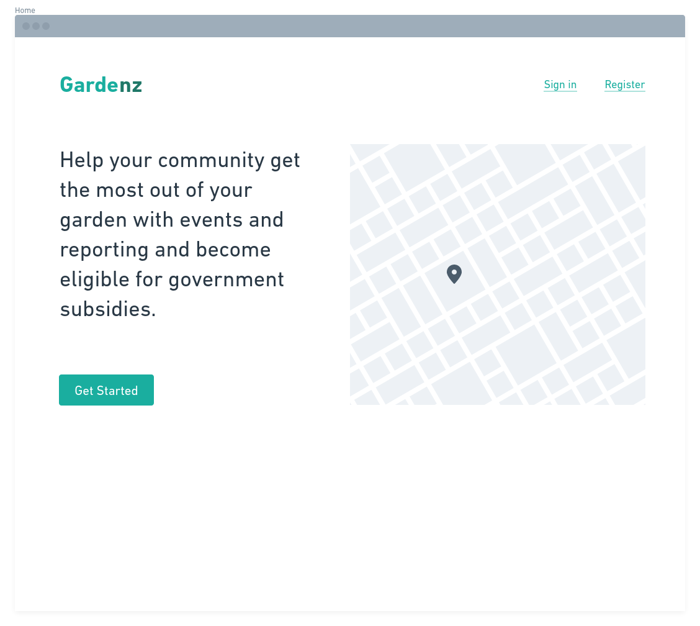
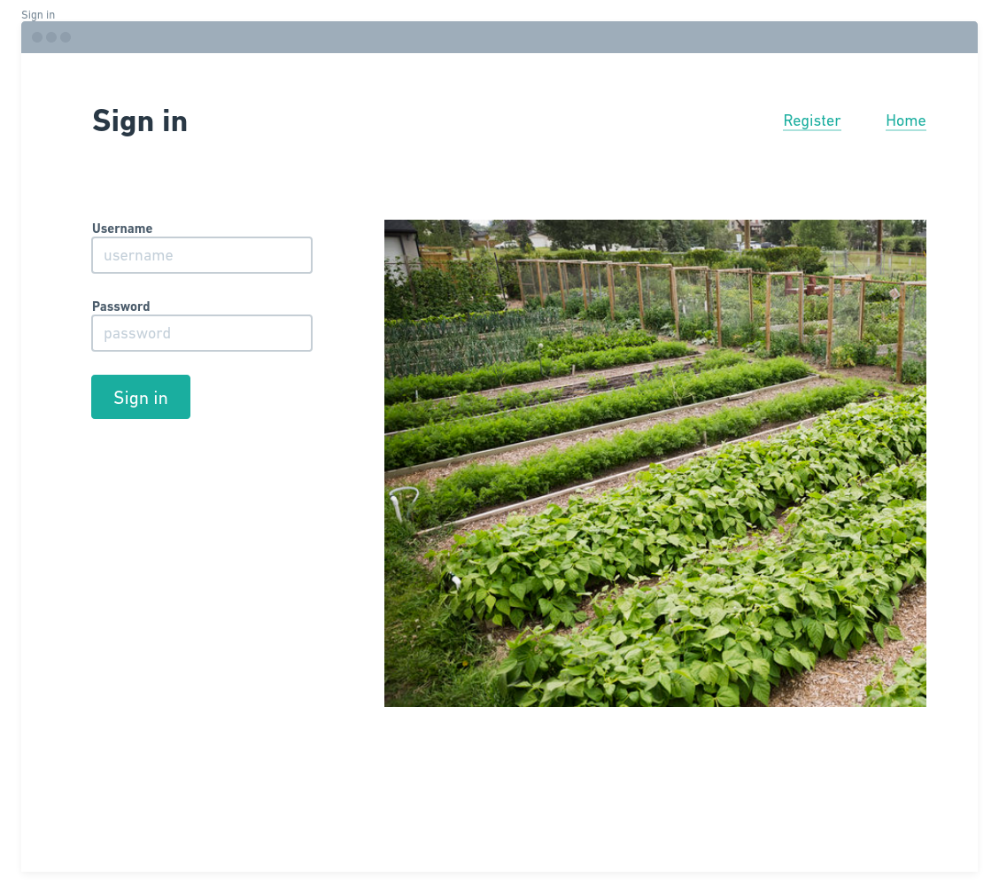
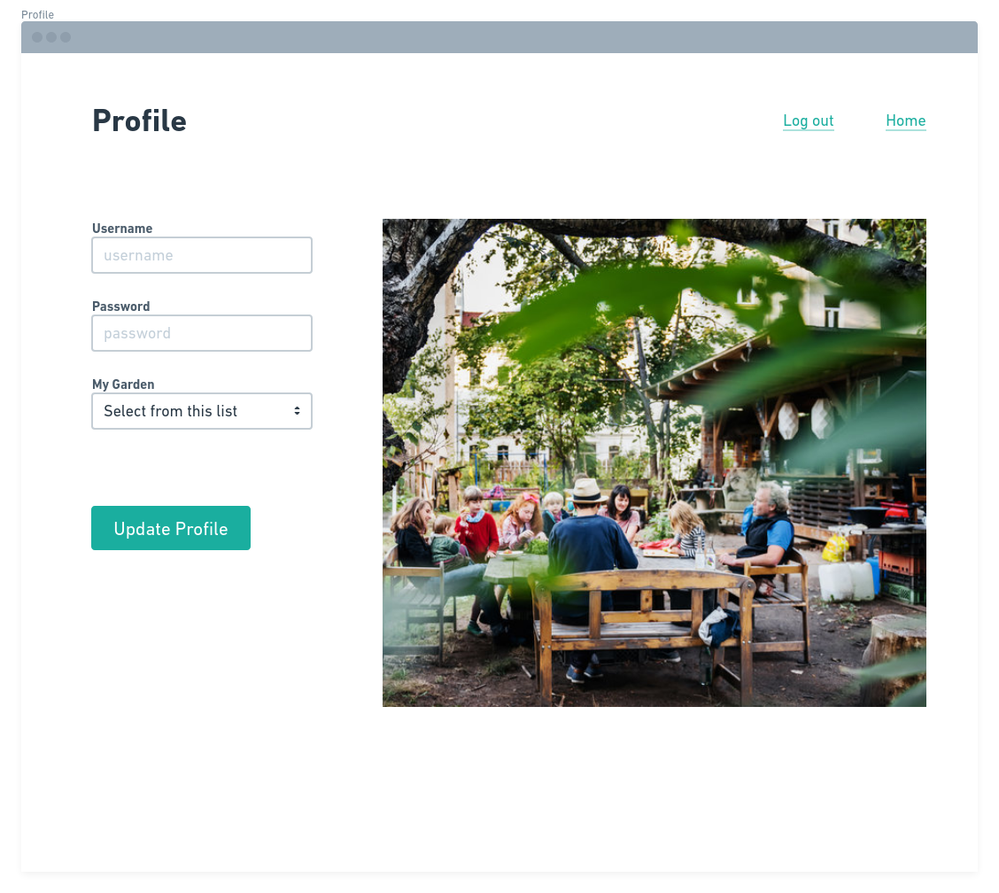
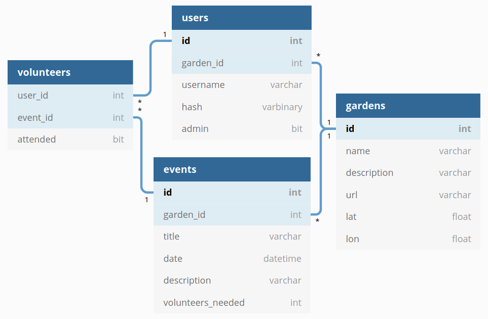

# Gardenz

> Empowering community gardens in New Zealand

## Setup

To get started, clone this repo and then:

```
cd gardenz
npm install
npm run db:migrate
npm run db:seed
npm run dev
```

You can find the server running on [http://localhost:3000](http://localhost:3000).

### CSS
SASS and Bulma have been added to the project. To use Bulmas variables and classes please refer to the documentation https://bulma.io/documentation/

## User stories (from highest priority)

1. As a community member, I want to see the gardens in my area.
1. As a garden administrator, I want to post a new garden event.
1. As a community member, I want to be notified of new garden events.
1. As a community member, I want to volunteer at my garden's events.
1. As a garden administrator, I want to see event volunteers.
1. As a garden administrator, I want to track event volunteers.


## User interface (proposal)

[Wireframe source on Whimsical](https://whimsical.com/Rf7Fo4MEMGxm5eLQ4uLYTA)







## API routes (proposal)

Failure response (HTTP status: 500):

```
{
  "error": {
    "title": "Unable to retrieve list of gardens"
  }
}
```

### `GET /api/v1/gardens`

Response (200):

```
{
  "gardens": [
    {
      "id": 1,
      "name": "Kelmarna Gardens",
      "address": "12 Hukanui Crescent",
      "lat": -36.86011508905973,
      "lon": 174.7330772002716,
      "url": "http://www.kelmarnagardens.nz",
      "events": [{
        "id": 1,
        "title": "Weeding Worker Bee",
        "datetime": "Wed, 27 Sep 2020 20:00:00 GMT"
      }]
    }
  ]
}
```


### `GET /api/v1/gardens/:id`

Response (200):

```
{
  "id": 1,
  "name": "Kelmarna Gardens",
  "address": "12 Hukanui Crescent",
  "description": "Kelmarna Gardens is a city farm and ...",
  "lat": -36.86011508905973,
  "lon": 174.7330772002716,
  "url": "http://www.kelmarnagardens.nz",
  "events": [{
    "id": 1,
    "volunteersNeeded": 8,
    "title": "Weeding Worker Bee",
    "datetime": "Wed, 27 Sep 2020 20:00:00 GMT",
    "description": "It's time to get these weeds under control."
  }]
}
```

### `POST /api/v1/events`

Request:

```
{
  "gardenId": 1,
  "volunteersNeeded": 8,
  "title": "Weeding Worker Bee",
  "datetime": "Wed, 27 Sep 2020 20:00:00 GMT",
  "description": "It's time to get these weeds under control."
}
```

Response (201):

```
{
  "id": 167,
  "gardenId": 1,
  "volunteersNeeded": 8,
  "title": "Weeding Worker Bee",
  "datetime": "Wed, 27 Sep 2020 20:00:00 GMT",
  "description": "It's time to get these weeds under control."
}
```

### `GET /api/v1/events/:id`

Response (200):

```
{
  "id": 167,
  "gardenId": 1,
  "volunteersNeeded": 8,
  "title": "Weeding Worker Bee",
  "datetime": "Wed, 27 Sep 2020 20:00:00 GMT",
  "description": "It's time to get these weeds under control."
}
```

### `POST /api/v1/events/:id/volunteers`

Request:

```
{
  "eventId": 167,
  "volunteerId": 48,
}
```

Response (201):

```
{
  "eventId": 167,
  "volunteerId": 48,
  "status": "added"
}
```

### `PATCH /api/v1/events/:id/volunteers`

Request:

```
{
  "eventId": 167,
  "volunteerId": 48,
  "action": "remove"
}
```

Response (200):

```
{
  "eventId": 167,
  "volunteerId": 48,
  "status": "removed"
}
```

## Database schema (proposal)


[Gardenz ERD on dbdiagram.io](https://dbdiagram.io/d/5f61c9407da1ea736e2e0bda)
