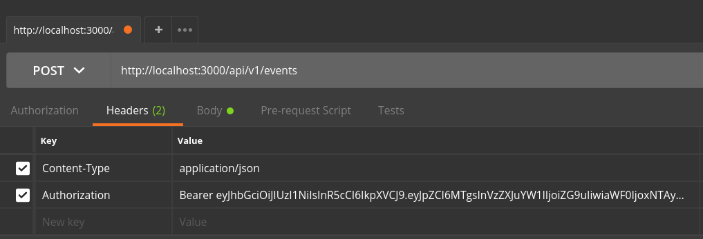

# API Authentication Tutorial

* Issue token
* Apply token
* Secure routes
* SSL encryption
* Password reset

## Issue token

Issuing a token is akin to registering for a new account. Once issued, the client will apply the token to each API call. The token represents the user's credentials, just like a username and password, but for API calls.

### Summary steps

1. Install dependencies
2. Create a `/api/v1/auth/register` route
3. Create a `users` table in the database and a module to work with it
4. Hash the password and save the hash instead of the clear-text password
5. Create a JSON Web Token (JWT) and issue it to the client

### Detailed steps

1. We're going to be POSTing JSON to our endpoints so we're going to need to tell Express how to process the body of the request messages.

    <details><summary>Show code</summary>

    ```js
    // server/server.js
    ...
    server.use(express.json())
    ```

    </details>

2. Create a new `server/routes/auth.js` file for your auth routes. The route should expose a `POST /api/v1/auth/register` route that accepts a JSON object with `username` and `password` properties. The `/api/v1/auth` part will be defined in `server/server.js` when we apply the router as middleware. Use a named `register` function for the route's callback instead of a typical inline anonymous function. _You'll see why in a later step._ You can leave the route empty at this point. We need the next step to complete it.

    <details><summary>Show code</summary>

    ```js
    // server/routes/auth.js
    const express = require('express')

    const router = express.Router()

    router.post('/register', register)

    function register (req, res) {
      const {username, password} = req.body
      // TODO: make sure username doesn't already exist
      // TODO: if not, hash the password and add the user to the database
    }

    module.exports = router
    ```

    </details>

3. Before we can complete this `/register` route, we need a place to save the new user. Here is an example knex migration you can use for your `users` table:

    ```js
    exports.up = (knex, Promise) => {
      return knex.schema.createTableIfNotExists('users', table => {
        table.increments('id')
        table.string('username')
        table.string('hash')
      })
    }

    exports.down = (knex, Promise) => {
      return knex.schema.dropTableIfExists('users')
    }
    ```

    Apply a migration so your database has a `users` table like the one above.

    <details><summary>Show terminal commands that use an npm knex script</summary>

    ```shell
    npm run knex migrate:make users
    # edit the migration file to be like the one above
    npm run knex migrate:latest
    ```

    </details>

4. Now we need a way to save the new user to the database. We should also make sure we can check that the username is available. Create a `server/db/users.js` file that exports these functions:

      * `userExists(username:string):Promise<boolean>`
      * `createUser(newUser:{username:string, password:string}):Promise`

    For now, just save the password in the `hash` field. We'll generate the hash in a later step.

    <details><summary>Show code</summary>

    ```js
    // server/db/users.js
    const connection = require('./connection')

    module.exports = {
      createUser,
      userExists
    }

    function createUser (username, password, conn) {
      const db = conn || connection
      return db('users')
        .insert({username, hash: password})
    }

    function userExists (username, conn) {
      const db = conn || connection
      return db('users')
        .count('id as n')
        .where('username', username)
        .then(count => {
          return count[0].n > 0
        })
    }
    ```

    </details>

5. Let's return to our `/register` route. Add the check for username availability and add the new user if it's available. Be sure to `require` the new `server/db/users.js` file and use its functions to complete the `register` function.

    * If the username is already taken, send back a status `400` and this JSON object: `{message: 'User exists'}`.
    * If the username is available, add the user and respond with a status `201`.
    * If there is an error, respond with a status `500` and this JSON object: `{message: err.message}`.

    <details><summary>Show code</summary>

    ```js
    // server/routes/auth.js
    const express = require('express')

    const {userExists, createUser} = require('../db/users')

    const router = express.Router()

    router.post('/register', register)

    function register (req, res) {
      userExists(req.body.username)
        .then(exists => {
          if (exists) {
            return res.status(400).send({ message: 'User exists' })
          }
          createUser(req.body.username, req.body.password)
            .then(() => res.status(201).end())
        })
        .catch(err => {
          res.status(500).send({ message: err.message })
        })
    }

    module.exports = router
    ```

    </details>

6. To make sure we can save new users, wire up the `/api/v1/auth/register` route into `server/server.js` and, using Postman, verify that when you can post a new user, it is saved to the database. Also verify you get back the expected HTTP response code when the username is already in use.

    <details><summary>Show code</summary>

    ```js
    // server/server.js
    const express = require('express')
    const passport = require('passport')

    const authRoutes = require('./routes/auth')

    const server = express()
    server.use(passport.initialize())
    server.use(express.json())

    server.use('/api/v1/auth', authRoutes)

    module.exports = server
    ```

    </details>

7. Saving clear-text passwords is _huge_ no-no. So let's fix that using the `sodium` npm package. Install `sodium` as a normal dependency.

    <details><summary>Show terminal command</summary>

    ```shell
    npm i sodium --save
    ```

    </details>

8. Write a new `hash.js` module in a new `server/auth` folder. We'll use this folder to hold some auth-related helper function. The `hash` module should export a `generate` function that takes the clear-text password as its only parameter, and use the `sodium` api to return a hash of that password.

    <details><summary>Show code</summary>

    ```js
    // server/auth/hash.js
    const sodium = require('sodium').api

    module.exports = {
      generate
    }

    function generate (password) {
      const passwordBuffer = Buffer.from(password, 'utf8')
      return sodium.crypto_pwhash_str(
        passwordBuffer,
        sodium.crypto_pwhash_OPSLIMIT_INTERACTIVE,
        sodium.crypto_pwhash_MEMLIMIT_INTERACTIVE
      )
    }
    ```

    </details>

9. We want to make it difficult to ever save a clear-text password. So call `generate` from the `createUser` function in `server/db/users.js`. Don't forget to import the `hash` module.

    <details><summary>Show code</summary>

    ```js
    // server/db/users.js
    const connection = require('./connection')
    const hash = require('../auth/hash')

    module.exports ...

    function createUser (username, password, conn) {
      const passwordHash = hash.generate(password)
      const db = conn || connection
      return db('users')
        .insert({username, hash: passwordHash})
    }

    function userExists ...
    ```

    </details>

    Start the server and use Postman to register new users. Look in your database and ensure the `hash` field for new users is a hash and not their clear-text password.

10. The last step in registering a new user is to create and issue a JSON Web Token (JWT) the client can use when making future requests to protected endpoints. For this we're going to use the `jsonwebtoken` npm package.

    To ensure a JWT is valid, it is signed with a secret string. We normally keep that string in an environment variable on the server. Let's use the `dotenv` npm package to help us manage our environment variables.

    Install `jsonwebtoken` and `dotenv` as a normal dependencies.

    <details><summary>Show terminal command</summary>

    ```shell
    npm i jsonwebtoken dotenv --save
    ```

    </details>

11. The `dotenv` package reads our environment variables from a `.env` file. Each line in the file is a new environment variable and follows this format:

    `NAME_OF_ENV_VAR=value_of_environment_variable`

    Create this file in the root of your project with a `JWT_SECRET` variable and a value of at least 20 characters.

    <details><summary>Show a sample `.env`</summary>

    ```
    JWT_SECRET=a31sl86dfk862jsd54lfk123lksjhd92
    ```

    </details>

12. **This is important**. Add the `.env` file to your `.gitignore`. You don't ever want this file to be committed to your source repository.

    <details><summary>Show code</summary>

    ```
    # .gitignore
    node_modules
    bundle*
    *.sqlite
    .env
    ```

    </details>

13. To enable the `dotenv` package so the environment variables are available, call its `config` function as early as possible in the server startup code (e.g. at the top of `server/index.js`).

    <details><summary>Show code</summary>

    ```js
    // server/index.js
    require('dotenv').config()
    var server = require('./server')

    var PORT = process.env.PORT || 3000

    server.listen(PORT, function () {
      console.log('Listening on port', PORT)
    })
    ```

    </details>

14. The JWT we issue should contain the user's ID and username, so we need an object that contains these properties. Export a `getUserByName` function from `server/db/users.js` that takes a username and returns a `Promise` that resolves to a user object.

    <details><summary>Show code</summary>

    ```js
    // server/db/users.js
    const connection = require('./connection')
    const hash = require('../auth/hash')

    module.exports = {
      createUser,
      userExists,
      getUserByName
    }

    function createUser ...

    function userExists ...

    function getUserByName (username, conn) {
      const db = conn || connection
      return db('users')
        .select()
        .where('username', username)
        .first()
    }
    ```

    </details>

15. Let's put the code for signing and issuing the token in a new `server/auth/token.js` module. This module should export an `issue` function. Because we're going to use it as Express middleware, it should have this signature:

    `issue(req:Request, res:Response, next:Function)`

    This function should use the `username` property on the request along with the new `getUserByName` function in `server/db/users.js` to retrieve the user from the database and create a JWT. The JWT secret is available from `process.env.JWT_SECRET`. The `sign` function from the `jsonwebtoken` package has this signature:

    `sign(user:Object, secret:string, options:Object)`

    The `options` parameter has an `expiresIn` property that is in [zeit/ms](https://github.com/zeit/ms) format.

    <details><summary>Show code for `server/auth/token.js`</summary>

    ```js
    // server/db/users.js
    const jwt = require('jsonwebtoken')

    const db = require('../db/users')

    module.exports = {
      issue
    }

    function issue (req, res) {
      db.getUserByName(req.body.username)
        .then(user => {
          const token = createToken(user, process.env.JWT_SECRET)
          res.json({
            message: 'Authentication successful.',
            token
          })
        })
    }

    function createToken (user, secret) {
      return jwt.sign({
        id: user.id,
        username: user.username
      }, secret, {
        expiresIn: '1d'
      })
    }
    ```

    </details>

16. The last step to implement user registration is to add the `token.issue` middleware function to the `register` route in `server/routes/auth`. Specifically,

    * Import `server/auth/token`
    * Add `token.issue` as the 3rd parameter to `router.post('/register')`
    * Add `next` as the 3rd parameter to the `register` function
    * After the user is created, call `.then(() => next())` instead of the `res.json` call

    <details><summary>Show code</summary>

    ```js
    // server/routes/auth.js
    const express = require('express')

    const {userExists, createUser} = require('../db/users')
    const token = require(../auth/token)

    const router = express.Router()

    router.post('/register', register, token.issue)

    function register (req, res, next) {
      userExists(req.body.username)
        .then(exists => {
          if (exists) {
            return res.status(400).send({ message: 'User exists' })
          }
          createUser(req.body.username, req.body.password)
            .then(() => next())
        })
        .catch(err => {
          res.status(500).send({ message: err.message })
        })
    }

    module.exports = router
    ```

    </details>

17. Now use Postman to register new users. You should see the JWT in the response body.


## Apply token

Now that the user has been issued a JWT token, it can use it for authentication when requesting a secured endpoint. Because JWTs are intended to be stateless, we effectively _sign in_ during each API call. We do this by adding it as an `Authorization` HTTP header to each request. This screenshot illustrates how to add the header using Postman:



Notice how the token returned during registration is after `Bearer ` in the value of the header (there is a space between `Bearer` and the token value). Now let's verify that token.

### Summary steps

1. Install dependencies
2. Create a middleware function to verify and decode the JWT
3. Use the contents of the token

### Detailed steps

We must be able to verify the authenticity of the token provided before we trust it. We can do this because it was signed with a secret (`JWT_SECRET`). Once we know we can trust it, we can decode it to extract the user's ID and username, which we will likely need to fulfil the request.

1. As we saw above, the token will come in on the `Authorization` header. The `express-jwt` package is capable of getting the token out of the header, verifying its authenticity and populating `req.user` with the contents of the decoded token. We just need to give it the secret we used to sign it. Install `express-jwt` as a normal dependency.

    <details><summary>Show terminal command</summary>

    ```shell
    npm i express-jwt --save
    ```

    </details>

2. To use `express-jwt` let's expose a `decode` function from our `server/auth/token` module. The `decode` function will be used as Express router middleware on all routes that need authentication. Here's how we'll use it:

    ```js
    // server/routes/example.js
    const token = require('../auth/token')

    router.get('/path', token.decode, (req, res) => {
      // now req.user will contain the contents of our token
    })`
    ```

    That means the signature of the `decode` function should look like this:

    `decode(req:Request, res:Response, next:Function)`

    <details><summary>Show start of `decode` function code</summary>

    ```js
    // server/auth/token.js
    module.exports = {
      issue,
      decode
    }

    function issue ...

    function decode (req, res, next) {

    }
    ```

    </details>

    The `express-jwt` package exports a function. Let's name it `verifyJwt`. We're going to call it inside of our `decode` function. The `verifyJwt` function accepts an object as a parameter where each property is an option. We only need to provide the `secret` option/property and its value should be a `getSecret` function.

    <details><summary>Show more of `decode` function's code</summary>

    ```js
    // server/auth/token.js
    const verifyJwt = require('express-jwt')

    ...

    function decode (req, res, next) {
      verifyJwt({
        secret: getSecret
      })
    }
    ```

    </details>

    The `getSecret` function is described in the `express-jwt` docs [here](https://github.com/auth0/express-jwt#multi-tenancy). Basically, it takes 3 parameters, the 3rd of which is an error-first callback that accepts the secret (`process.env.JWT_SECRET`) as the 2nd parameter.

    <details><summary>Show code for `getSecret` function</summary>

    ```js
    // server/auth/token.js
    function getSecret (req, payload, done) {
      done(null, process.env.JWT_SECRET)
    }
    ```

    </details>

    Lastly, the `verifyJwt` function returns a function with the same parameters as our `decode` function. So let's just pass the parameters through to that function call.

    <details><summary>Show all new code in `server/auth/token`</summary>

    ```js
    // server/auth/token.js
    const verifyJwt = require('express-jwt')

    function decode (req, res, next) {
      verifyJwt({
        secret: getSecret
      })(req, res, next)
    }

    function getSecret (req, payload, done) {
      done(null, process.env.JWT_SECRET)
    }
    ```

    </details>

3. To test this is working correctly, let's create an `/api/v1/auth/username` route that returns the username of the requester. The username is encoded into the token so it will be on the `req.user` object after our `token.decode` function is applied.

    Start with creating a `GET /username` route in `server/routes/auth.js` that looks similar to the example at the beginning of step 2. In the route, respond with a JSON object that has a `username` property with a value of `req.user.username`.

    <details><summary>Show code</summary>

    ```js
    // server/routes/auth.js
    const token = require('../auth/token')

    router.get('/username', token.decode, (req, res) => {
      res.json({
        username: req.user.username
      })
    })
    ```

    </details>

    Make sure you've registered a new user and captured the JWT token in the response body. Configure postman with the `Authorization` header and issue a `GET` request to `/api/v1/auth/username`. If all is well, the response will be:

    ```js
    {
      "username": "your username"
    }
    ```

    Congratulations! You're verifying JWT tokens!

## Secure routes

_forthcoming_

## SSL encryption

_forthcoming_

## Password reset

_forthcoming_
