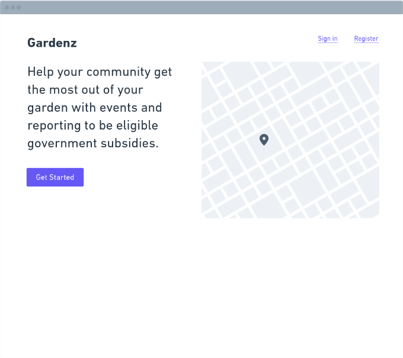
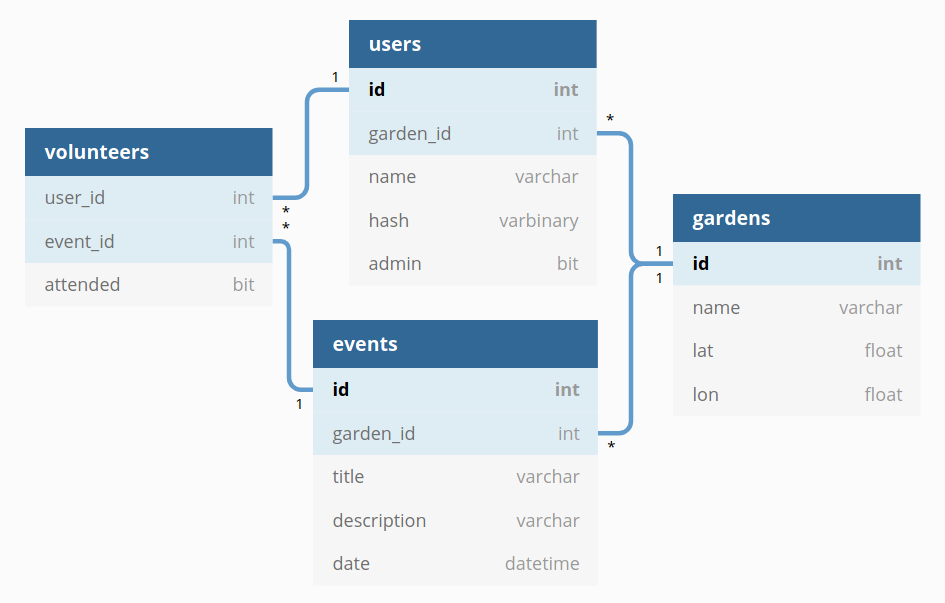

# Gardenz

> Empowering community gardens in New Zealand

## Setup

To get started, clone this repo and then:

```
cd gardenz
npm install
npm run db:migrate
npm run db:seed
npm run dev
```

You can find the server running on [http://localhost:3000](http://localhost:3000).


## User interface (proposal)

[Wireframe source on Whimsical](https://whimsical.com/Rf7Fo4MEMGxm5eLQ4uLYTA)




## API routes (proposal)

Failure response (HTTP status: 500):

```
{
  "error": {
    "title": "Unable to retrieve list of gardens"
  }
}
```

### `GET /api/v1/gardens`

Success response (200):

```
{
  "gardens": [
    {
      "id": 1,
      "name": "Kelmarna Gardens",
      "address": "12 Hukanui Crescent",
      "lat": -36.86011508905973,
      "lon": 174.7330772002716,
      "url": "http://www.kelmarnagardens.nz",
      "events": [{
        "id": 1,
        "title": "Weeding Worker Bee",
        "datetime": "Wed, 27 Sep 2020 20:00:00 GMT"
      }]
    }
  ]
}
```


### `GET /api/v1/gardens/:id`

### `POST /api/v1/events`

### `GET /api/v1/events/:id`

### `POST /api/v1/events/:id/volunteers`


## Database schema (proposal)


[Gardenz ERD on dbdiagram.io](https://dbdiagram.io/d/5f61c9407da1ea736e2e0bda)
