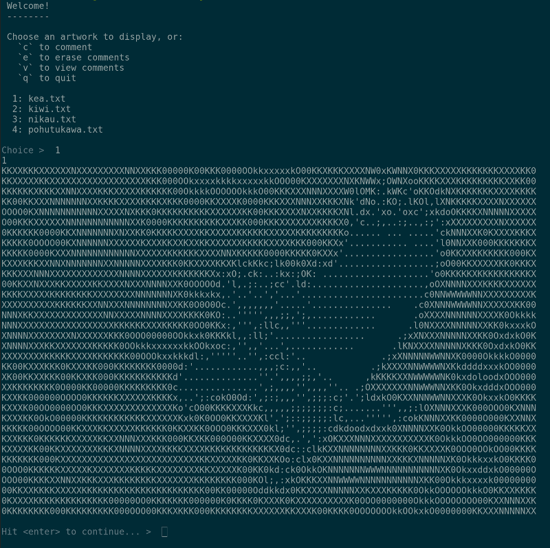

# ASCII Art Reader

Build a state of the (ASCII) art terminal client. Don't forget to maximise your terminal window on one screen. You'll need the space!




## Learning objectives

1. Reading and writing files.
1. Getting used to asynchronous functions and callbacks.
1. A first try at writing tests for async functions.


## Getting started

1. Clone this repo and create a new branch for you or your pair.
1. You'll be working in `index.js` (once you start adding functionality, you can run your app with `npm start`)


## MVP

> An MVP is a _Minimum Viable Product_. It's the least amount of work you can do and still have a working project!

Here are some user stories to guide your work. We'll talk more about user stories during the bootcamp. In the meantime, try to implement these. Think of them as requests from a fictitious client.

1. _As a user, I'd like to see a welcome message (so that I feel, y'know, welcome)._
    - Start small. You'll use `console.log` statements a lot in this project, since the terminal _is_ the console!
1. _As a user, I'd like to view a list of ASCII artworks that can be displayed so that I can make my choice._
    - Here's where you show a list of filenames from the `data` directory. You can choose to keep these in your code for now.
    - Hint: start counting from 0, it will make indexing an array that much easier.
1. _As a user, when I enter the number next to an artwork in the list, the artwork will be displayed (so that I can see it!)_
    - There's a section on [terminal helpers](#terminal-helpers) below. Try using the `readline` function, it's a good way to practice callbacks.
    - Again, start small. Try to get the number from the user and display it in the terminal.
    - Once you have that, use the number to get the filename. Maybe the filenames are in an array, and the numbers are the array indices?
    - When you have the right filename, use `fs.readFile` to load the file.
    - Finally, inside the callback for `fs.readFile`, use `console.log` to output the file's contents to the terminal.


## Stretch goals

> A _stretch goal_ is one you're not sure if you'll have time for, but would be great to have in the project.

Ready for more? Here's some ideas for what to work on next!

1. _As a user, I want the menu to display again after I view an artwork so that I can choose another one._
    - Maybe turn the main menu into a function you can call any time you want to?
    - In order to not scroll the 'image' off the screen, you might want to ask the user to press enter before continuing.
1. _As a user, I want to be able to quit when I press `q` so that I can return to the terminal prompt._
    - Hint: `process.exit()`
1. _As a user, I want to be able to write a comment to a file when I press `c` so that I can voice my opinion._
    - Here's your chance to practice with `fs.writeFile`!
    - Don't get too fancy at first. Just accept a line of input into a variable, and write that variable out again to a file called `data/comments.txt`.
1. _As a user, I want to view the comments file when I press `v` so that I can see all the latest comments._
    - Once you have comment display working, try adding another comment. What happens to the first one?
1. _As a user, I want my comments to be preserved so that I don't overwrite my last one with the latest one._
    - Here's a good use case for `fs.appendFile`.


## More stretch

Still not enough for you? Check these out:

1. _As a user, I want to be able to erase all the comments so that I can start afresh._
    - Think about how to remove the contents of the file without actually deleting it. Or perhaps it should be deleted?
    - You'll need to add another key to the menu, perhaps 'd'.
    - You may want to think about an "Are you sure?" prompt to prevent accidents.
1. _As a user, I want any new artworks I add to the data directory to be listed, so that I don't need to modify the program every time._
    - Hint: `fs.readdir` This is another chance to practice callbacks.


## Testing

> We don't always write tests that hit the filesystem, because they can be quite slow and they test more than one thing at a time. However, it's good practice using tests and testing functions that accept callbacks!

### Setup

By now you should be getting used to setting up Node programs. Here's a reminder in case you need it, but most of it is already done for you:

1. Create an npm `package.json` file using `npm init`.
1. Install `jest` as dev dependencies (use `-D`).
1. Write a couple of scripts in your `package.json`:
    - one that starts the program
    - one that runs all the tests
1. Create a `tests` directory.
1. Write a simple initial test that proves the tests run ok.

You'll see we've included a data directory with some text files in it. You'll need those in a bit.

It can be quite fiddly to write tests that check what gets sent to the console, so we're not going to do that now. Instead, we should focus on testing your functions that read and write files.

One approach might be to create a very simple test file. Call it `test.txt` (or similar). Put a simple string inside, and keep it inside your `tests` directory so it doesn't have anything to do with the main program.

This should let you test some of your functions. For example, you could check that the:
 - string returned from your read function is the same as the one you put in `test.txt`
 - number of lines in a file has changed after you write to it (hint: count the newline `\n` characters)
 - file has no lines in it after your delete comments function runs (might need to use a different test file for that one)

If you're writing a test that changes something on the filesystem, be sure to return the state of whatever you change to normal at the end of the test.  If you're having trouble writing your tests, remember to reach out for help sooner rather than later. Be kind to yourself, and don't expect to understand everything right away.


## Terminal helpers

Writing programs for the terminal will be a new experience for some. Our advice is to keep it really simple at first. Something you may find is that you need a way to wait for input from the terminal, for example when choosing which file to display. `readline`, which comes with the Node standard library, will let you pause your program until the user hits enter, then call whatever function you want:

```js
const readline = require('readline')

function pressEnter () {
  const rl = readline.createInterface({
    input: process.stdin,
    output: process.stdout
  })

  rl.question('Which file should I load? ', function (input) {
    rl.close()

    // Call any functions you like here. For example:
    loadFile(input)
  })
}
```

As you can see, `readline` gives you even more practice with callbacks! If you want to get a little more fancy, try using the `prompt` npm package for input. An example of how you might use it:

```js
const prompt = require('prompt')

prompt.message = ''
prompt.delimiter = ': '
prompt.start()

const choice = {
  name: 'choice',
  hidden: true,
  message: 'Make your choice'
}

prompt.get(choice, function (err, result) {
  // Do something with result.choice here...
})
```

The callback you pass to `prompt.get` will receive an object that has a property with the name of your input, so for example:

```js
{
  choice: '1'
}
```
