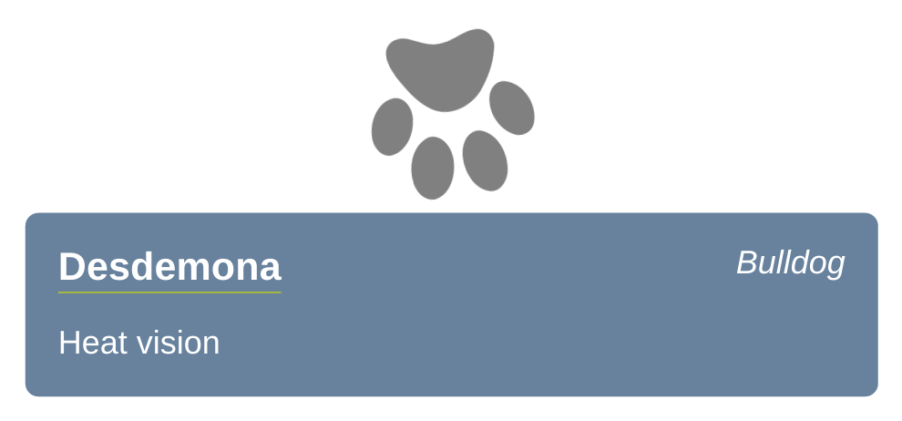

# Paws for Effect

This tutorial walks you through the basics of React development. By the end of it, you should have been exposed to:

 1. Creating simple components
 2. Using components inside other components
 3. Passing props to components
 4. Setting initial state on a component
 5. Using JavaScript expressions inside JSX.
 6. Using `Array.map` to display a series of components.


## Install

Fork the repo from https://github.com/dev-academy-challenges/react-paws-for-effect . There are a series of tutorials and challenges that use this code base, so it makes sense to have your own copy of it. The 'fork' button is at the top right of the page. Be sure to fork it to your own GitHub account, not the cohort's one!

Once you've done that, clone it down from your GitHub and:

```shell
npm install
npm start
```

This will start `webpack-dev-server`. If you navigate to http://localhost:8080 in your browser you should see a spinning paw.


## The App component

If you take a look at `index.html`, you'll see there's a single div with the id `App`. It's just there for React to bind with. In `src/index.js`, we find this:

```js
import App from './components/App'

document.addEventListener('DOMContentLoaded', () => {
  ReactDOM.render(
    <App/>,
    document.getElementById('app')
  )
})
```

Plain ol' `DOMContentLoaded`, like in Phase 0. So to start our React app off, we listen to make sure that the DOM has been loaded by the browser before _rendering_ our components (making them show up on the page).

Take a look at `src/components/App.jsx`:

```jsx
export default React.createClass({
  render () {
    return (
      <div className="container">
        
      </div>
    )
  }
})
```

The only thing we have here is a `render` function. All it does is return some [markup](https://en.wikipedia.org/wiki/Markup_language), expressed as [JSX](https://jsx.github.io/). Instead of rendering a template, such as we do when using [Handlebars](https://handlebarsjs.com), we're dealing here with small chunks of the page at a time which are inserted into `index.html`. Each 'chunk' (component) can contain other components, some of which can be repeated to build lists of items on the page.


## The Dog component

Let's try another component. In your editor, make a new component called `Dog.jsx` and save it into the `src/components` directory:

```jsx
export default React.createClass({
  propTypes: {
    name: React.PropTypes.string.isRequired,
    breed: React.PropTypes.string.isRequired,
    superpower: React.PropTypes.string
  },

  render () {
    return (
      <div className="dog-wrapper">
        <div className="dog">
          <div className="dog-name-plate">
            <span className="dog-name">{this.props.name}</span>
            <span className="dog-breed">{this.props.breed}</span>
          </div>
          <span className="dog-superpower">{this.props.superpower}</span>
        </div>
      </div>
    )
  }
})
```

Copy/paste will do for this one. Notice that it looks a lot like `App.jsx`, except there are a few extra tags and we're making use of _props_. The props come from what we would normally think of as 'attributes' on the component's tag in JSX:

```jsx
<Dog name="Desdemona" breed="Bulldog" superpower="Heat vision" />
```

Here, `name`, `breed`, and `superpower` are _props_. The `Dog` component will receive them as a JavaScript object like so:

```js
{
  props: {
    name: 'Desdemona',
    breed: 'Bulldog',
    superpower: 'Heat vision'
  }
}
```

When we refer to a prop in JSX we have to put it inside curly braces, like so:

```jsx
<span>{this.props.name}</span>
```

We should also specify some `propTypes`. These specify what kind of JavaScript values our props should be treated as.

```js
  propTypes: {
    name: React.PropTypes.string.isRequired,
    breed: React.PropTypes.string.isRequired,
    superpower: React.PropTypes.string
  },
```

Try it out! In `App.jsx`, import your new Dog component:

```js
import Dog from './Dog.jsx'
```

and add a Dog tag (use Desdemona, above if you like). Your `render` function should look something like this:

```jsx
  render () {
    return (
      <div className="container">
        
        <Dog name="Desdemona" breed="Bulldog" superpower="Heat vision" />
      </div>
    )
  }
```

You should see something like this in the browser:



> Try adding more dogs, right underneath the first one. Notice what happens when you don't provide one of the values?


## Simpler components

Components don't have to be complex. Sometimes it makes sense to have components that don't have a lot of bells and whistles. We call these _stateless_ components (or stateless functions). For example:

```js
import React from 'react'

const EmphasisedLink = props => <em><a href={props.url}>{props.text}</a><em>
EmphasisedLink.propTypes = { 
  text: React.PropTypes.string.isRequired,
  url: React.PropTypes.string.isRequired
}
export default EmphasisedLink
```

All our component does is return some JSX. We set some prop types and export it.

Try it yourself. Define a stateless component called `Subtitle` that takes just one prop, `text`, and wraps it in `<h2>` tags. Import it in the App component and use it like so:

```jsx
    
    <Subtitle text="Canines using supercanine abilities for social good." />
    <Dog name="Desdemona" breed="Bulldog" superpower="Heat vision" />
```

You should see something like this:


The `images` directory contains a few dog silhouettes. Try modifying the components to add an image for each `Dog`. Look in the `tutorial` branch for hints if you get stuck.
