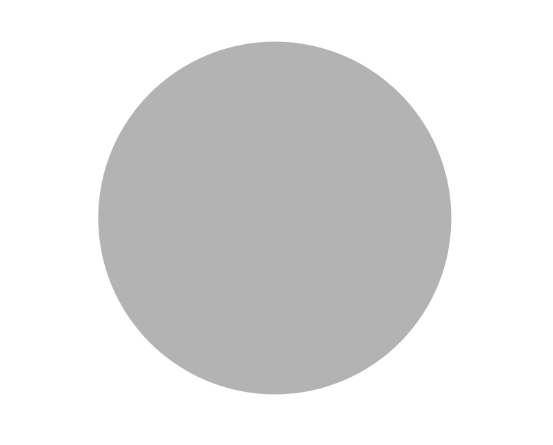

# Enspiraled

For this challenge, you'll be making a basic fractal generator that starts with a single large circle. When you click a circle, four more circles appear. And each circle behaves this way, forever (or when you stop clicking).

After you've completed this project, this is what it can look like after a few clicks:


## Setup

### 0. Cloning and installation

- [ ] Clone this repo, navigate to it, install packages, and start the server with `npm run dev`
  <details style="padding-left: 2em">
    <summary>Tip</summary>

  ```sh
  cd enspiraled
  npm i
  npm run dev
  ```

  </details>

- [ ] Visit [http://localhost:3000](http://localhost:3000) in your browser
  <details style="padding-left: 2em">
    <summary>Tip</summary>

  This is what your starting place looks like:

  
  </details>

---

## Requirements

### 1. Getting situated

- [ ] Examine `client/components/App.jsx`
  <details style="padding-left: 2em">
    <summary>More about the <code>&lt;App&gt;</code> component</summary>

  Here are its contents:

  ```jsx
  import React from 'react'

<<<<<<< HEAD
  const App = (props) => {
    const circle = {
      cx: props.width / 2,
      cy: props.height / 2,
      level: 0,
      r: 256,
=======
    function App(props) {
      const circle = {
        cx: props.width / 2,
        cy: props.height / 2,
        level: 0,
        r: 256
      }

      return (
        <svg width={props.width} height={props.height}>
          <circle cx={circle.cx} cy={circle.cy} r={circle.r} />
        </svg>
      )
>>>>>>> main
    }

    return (
      <svg width={props.width} height={props.height}>
        <circle cx={circle.cx} cy={circle.cy} r={circle.r} />
      </svg>
    )
  }

  export default App
  ```

<<<<<<< HEAD
  The `App` component is implemented as a stateless functional component. The `props` are defined in `client/index.tsx`, if you're curious. We use the width and height of the window to center the circle in the browser. This component renders [Scalable Vector Graphics](https://developer.mozilla.org/en-US/docs/Web/SVG): an `<svg>` element with an SVG `<circle>` element in it. It has a radius of 256px (`r`) and is filled with a translucent grey established in `server/public/css/app.css`. It's important to note that this JSX will render The SVG elements, **not React controls**. We know this because `<svg>` and `<circle>` are lower case.
=======
    The `App` component has no state, but receives two props, `width` and `height` (which are the width and height of the page--have a look in `client/index.js` to see how these are retrieved).

    This component renders [Scalable Vector Graphics](https://developer.mozilla.org/en-US/docs/Web/SVG): an `<svg>` element with an SVG `<circle>` element in it. It has a radius of 256px (`r`) and is filled with a translucent grey (see `server/public/css/app.css`). It's important to note that this JSX will render The SVG elements, **not React controls**. We know this because `<svg>` and `<circle>` are lower case.
  </details>

- [ ] Since each SVG `<circle>` element will be the same, create a new `Circle.jsx` React component for it
  <details style="padding-left: 2em">
    <summary>Tip</summary>

    ```jsx
    import React from 'react'

    export default function Circle(props) {
      
      // ... other logic

      return (
        <>
        {/* ... other components */}
          <circle cx={props.cx} cy={props.cy} r={props.r} />
        </>
      )
    }
    ```
>>>>>>> main
  </details>

### 2. Interacting with circles

- [ ] As you click a circle, four more circles should appear at the cardinal compass points: _north, south, east and west_--these will be known as the **"children"** of the clicked circle, which will be known as the **"parent"** circle
  <details style="padding-left: 2em">
    <summary>Tip</summary>

    React components can render other React components, but they can also render themselves. I.e., a `<Circle>` component can render other `<Circle>` components inside of it. This will be helpful when trying to add 4 more circles with different `cx`, `cy`, and `r` props. In general computer science, this is called _recursion_.
  </details>

- [ ] The radius of the 4 new **children** circles should be half of the **parent** circle

- [ ] A circle should only create 4 new children **once**. Subsequent clicks should create no visible change

Once you've got the functionality, have fun with new colours for each generation!

---

## Things to consider

<details>
  <summary>Guidance on completing the challenge</summary>
  
  - If you don't already have it installed, you should install the React DevTools browser extension ([Firefox](https://addons.mozilla.org/en-US/firefox/addon/react-devtools/) and [Chrome](https://chrome.google.com/webstore/detail/react-developer-tools/fmkadmapgofadopljbjfkapdkoienihi?hl=en)). This will add a tab in Developer Tools that will allow you to explore the [virtual DOM](http://tonyfreed.com/blog/what_is_virtual_dom) used by React

<<<<<<< HEAD
- Because every circle behaves the same way, you could create a new `Circle` component in `client/components/Circle.tsx` that wraps the SVG `<circle>` element and adds some new features (like state)

- When a `<Circle>` is showing itself, it should use the SVG `<circle>` element, but when it's showing it's children, it should use new `<Circle>` components

- The `<Circle>` component should keep its child circles as an array in state. It will only have children if it has been moused over

- You can apply a mouseover event to the SVG `circle` element like this:
  `<circle cx={cx} cy={cy} r={r} mouseover={handleMouseOver} />`
  The `handleMouseOver` function can be defined in the same `Circle.tsx` file

- Once you've got the functionality, have fun with new colours for each generation!
=======
  - The `<Circle>` component should keep its child circles as an array in state. It will only have children if it has been clicked

  - A `<Circle>` may render two things
    1. A single `<circle>` element (SVG element)
    2. 4 child `<Circle>` components (React component)

  - You can apply a click event to the SVG `<circle>` element like this:
    ```jsx
    <circle cx={cx} cy={cy} r={r} onClick={handleClick} />
    ```

    The `handleClick` function should be defined within the `<Circle>` component.
</details>

___

## Stretch

<details>
  <summary>More about stretch challenges</summary>

  Woohoo! You've made some fractal circles! Now, let's make them more interesting.

  1. Stop generating new circles once there are 7 generations of circles

  1. When you double click a circle, it should remove all of its children circles

  1. Add a button to the page that will clear the screen and start over
  
>>>>>>> main
</details>


---

## Further reading

<details>
  <summary>More reading</summary>

<<<<<<< HEAD
- [SVG](https://developer.mozilla.org/en/docs/Web/SVG)
- [SVG `circle`](https://developer.mozilla.org/en-US/docs/Web/SVG/Element/circle)
- [React Component](https://facebook.github.io/react/docs/reusable-components.html)
- [React's `useState`](https://reactjs.org/docs/hooks-reference.html#usestate)
- [Color](https://developer.mozilla.org/en/docs/Web/CSS/color_value)
=======
  * [SVG](https://developer.mozilla.org/en/docs/Web/SVG)
  * [SVG `circle`](https://developer.mozilla.org/en-US/docs/Web/SVG/Element/circle)
  * [React Component](https://facebook.github.io/react/docs/reusable-components.html)
  * [React's `useState`](https://reactjs.org/docs/hooks-reference.html#usestate)
  * [Color](https://developer.mozilla.org/en/docs/Web/CSS/color_value)
  * [A Sierpinksi Triangle](https://en.wikipedia.org/wiki/Sierpi%C5%84ski_triangle): A great example of graphical recursion
>>>>>>> main
</details>

---

[Provide feedback on this repo](https://docs.google.com/forms/d/e/1FAIpQLSfw4FGdWkLwMLlUaNQ8FtP2CTJdGDUv6Xoxrh19zIrJSkvT4Q/viewform?usp=pp_url&entry.1958421517=enspiraled)
