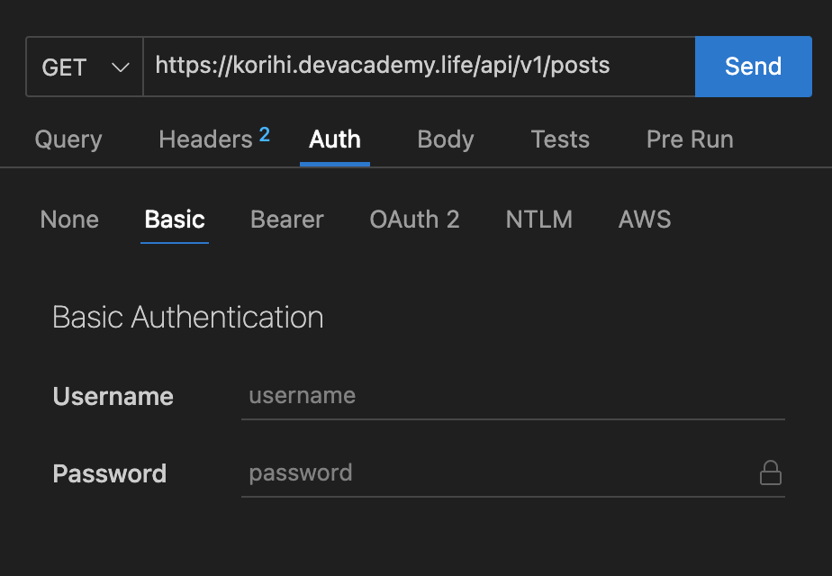

# Korihi: A micro blog for a macro world

Korihi is a micro-blogging application like twitter/x, bluesky or mastodon, but the frontend isn't quite finished

You're going to use the existing API to complete some of our app's features

## Setup

### 0. Installation

- [ ] Clone this repo and `cd` into the new directory
- [ ] Get a username and password

  Your facilitator should have assigned you a username and a randomly generated password, make sure you keep them somewhere so you don't forget them

- [ ] Create a `.env` file in your root with your `VITE_API_HOST`

  We're going to develop against the live API so your `.env` file should look like this

  ```.env
  VITE_API_HOST='https://korihi.devacademy.life'
  VITE_USERNAME='put your username here'
  VITE_PASSWORD='put your password here'
  ```

  _Warning_: this is not how we would store or provide your password in a more realistic app

- [ ] Install packages and start the dev server
  ```sh
  npm install # or npm i for short
  npm run dev
  ```
- [ ] Visit the home-page

  Vite will log out a url similar to [[http://localhost:5173]]

- [ ] Investigate the API

  Open up Thunderclient and make a `GET` request to `https://korihi.devacademy.life/api/v1/posts`

  Korihi uses [Basic Authentication](https://developer.mozilla.org/en-US/docs/Web/HTTP/Authentication#basic_authentication_scheme), so make sure you configure your username and password in Thunder client:



  You should see a list of posts presented as a JSON document

## 1. Write the hook to fetch posts for the timeline

- [ ] Take a look at the component AllPosts.tsx
      This component imports a hook called usePosts to get the post data

  ctrl-click (or ⌘-click in Mac OS) on the name of the function to "go to definition". Alternatively you can right click

- [ ] Complete the definition of the `usePosts` hook

  Look at the completed `usePost` hook for reference

  <detail>
    <summary>Hints</summary>
    - use `.auth` to add authentication to the request
    - use superagent to make a `GET` request to the same URL we used earlier 
    - cast your `response.body` to a `PagedPosts`
  </detail>

- [ ] Check the timeline page in the browser

- [ ] Run the tests for the timeline page

      Filter to these specific tests with`npm test -- TimelinePageShowsPosts`

## 2. Authoring posts

- [ ] Author a post with Bruno/Thunderclient

  We author a post by sending a POST request to `/api/v1/posts`

  Don't forget to include your username and password with Basic Authentication

  Visit the home page to see your new post on the timeline

- [ ] Write a mutation to author a post

  In `./client/hooks/use-posts.ts` delete the placeholder `useCreatePost` function and write your own with `useMutation`.

  You can reference the finished `useUpdateUser` function in `./client/hooks/use-updateuser.ts` as an example.

  <details>
    <summary>Hints</summary>
    - call `useQueryClient()` to get an instance of the queryClient
    - provide a `mutationFn` that is async, accepts an object of values and makes a POST request
      to the API
    - provide an `onSuccess` function that calls `client.invalidateQuery({ queryKey: ['posts'] })` on
      the client you got from `useQueryClient()`. This will mark the timeline data as stale forcing it to refresh.
  </details>

- [ ] Author a post in the browser

  The form at the top of the page should work now (if you're logged in), so write a post and see it
  appear in the timeline.

- [ ] Run the tests for authoring posts

  run `npm test -- AuthoringANewPost` to just see the relevant posts

## Stretch: edit your user profile

If you visit your own profile page at `/u/$USER_NAME` (or by clicking on your username next to the "logged in as" message)

- [ ] Write the tests for viewing your profile page

  The test file is created with some boilerplate at [ProfilePageShowsMyData](./client/pages/ProfilePageShowsMyData.test.tsx)

  Use the tests in [PostPageDisplaysPost](./client/pages/PostPageDisplaysPost.test.tsx) as an example

- [ ] Add a form to the profile page to update your profile information

  The form can use the `useUpdateUser` function in `./client/hooks/use-updateuser.ts`

  use the [AuthorPostForm](./client/components/AuthorPostForm.tsx) as a reference

- [ ] Write tests for your new form

  Use the [AuthoringANewPost](./client/pages/AuthoringANewPost.test.tsx) tests as an example

---

[Provide feedback on this repo](https://docs.google.com/forms/d/e/1FAIpQLSfw4FGdWkLwMLlUaNQ8FtP2CTJdGDUv6Xoxrh19zIrJSkvT4Q/viewform?usp=pp_url&entry.1958421517=korihi)
