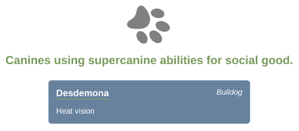

# Paws for Effect

This challenge walks you through the basics of React development.

Learning objectives: 

 1. Creating simple components
 2. Using components inside other components
 3. Passing props to components
 4. Using JavaScript expressions inside JSX
 5. Using `Array.map` to display a series of components


## Setup

### 0. Cloning and installation
- [ ] Clone this repo, navigate to it, install packages, and start the server with `npm run dev`
  <details style="padding-left: 2em">
    <summary>Tip</summary>

    ```sh
    npm install
    npm run dev
    ```
  </details>


---
## Requirements

### 1. The `<App>` component

- [ ] Investigate `server/public/index.html` and `client/index.js`
  <details style="padding-left: 2em">
    <summary>More about the <code>index</code> files</summary>

    If you take a look at `server/public/index.html`, you'll see there's a single div with the id `app`. It's just there for React to bind with. In `client/index.js`, we find this:

    ```js
    import App from './components/App'

    document.addEventListener('DOMContentLoaded', () => {
      ReactDOM.render(
        <App/>,
        document.getElementById('app')
      )
    })
    ```
    
    Plain 'ole `DOMContentLoaded`, like you've seen in Foundations. So to start our React app off, we listen to make sure that the DOM has been loaded by the browser before **rendering** our components (making them show up on the page).
  </details>

- [ ] Next, take a look at `client/components/App.jsx`
  <details style="padding-left: 2em">
    <summary>More about <code>App.jsx</code></summary>

    ```jsx
    const App = () => (
      <div className='container'>
        
      </div>
    )

    export default App
    ```

    Effectively this whole functional component is a `render` function. All it does is return some [markup](https://en.wikipedia.org/wiki/Markup_language), expressed as [JSX](https://jsx.github.io/). Instead of rendering a template, such as we do when using [Handlebars](https://handlebarsjs.com), we're dealing here with small chunks of the page at a time which are inserted into `index.html`. Each 'chunk' (component) can contain other components, some of which can be repeated to build lists of items on the page.
  </details>

### 2. The `<Dog>` component

Let's try another component.
- [ ] In your editor, make a new component file called `Dog.jsx`, and give it some content
  <details style="padding-left: 2em">
    <summary>More about <code>Dog.jsx</code></summary>

    First, save it into the `client/components` directory.

    Copy/paste the following for the contents of Dog.jsx
    ```jsx
    import React from 'react'

    const Dog = (props) => {
      return (
        <div className='dog-wrapper'>
          <div className='dog'>
            <div className='dog-name-plate'>
              <span className='dog-name'>{props.name}</span>
              <span className='dog-breed'>{props.breed}</span>
            </div>
            <span className='dog-superpower'>{props.superpower}</span>
          </div>
        </div>
      )
    }

    export default Dog
    ```

    Notice that it looks a lot like `App.jsx`, except there are a few extra tags and we're making use of **props**.
  </details>

  <details style="padding-left: 2em">
    <summary>More about props</summary>

    The props come from what we would normally think of as **attributes** on the component's tag in JSX:

    ```jsx
    <Dog name='Desdemona' breed='Bulldog' superpower='Heat vision' />
    ```

    Here, `name`, `breed`, and `superpower` are **props**. The `<Dog>` component will receive them as a JavaScript object like this:

    ```js
    const props = {
      name: 'Desdemona',
      breed: 'Bulldog',
      superpower: 'Heat vision'
    }
    ```

    When we refer to a prop in JSX we have to put it inside curly braces, like this:

    ```jsx
    <span>{props.name}</span>
    ```
  </details>

- [ ] Now let's use it. In `App.jsx`, import your new `<Dog>` component and give it some attributes
  <details style="padding-left: 2em">
    <summary>More about implementing the <code>&lt;Dog&gt;</code> component</summary>

    In `App.jsx`, import the `<Dog>` component
    ```js
    import Dog from './Dog.jsx'
    ```

    and add a `<Dog>` tag (use Desdemona, above if you like). The JSX returned should look something like this:

    ```jsx
    (
      <div className='container'>
        
        <Dog name='Desdemona' breed='Bulldog' superpower='Heat vision' />
      </div>
    )
    ```
    
    > To understand why no explicit 'return' statement is needed here, check out MDN's docs on [Arrow functions](https://developer.mozilla.org/en-US/docs/Web/JavaScript/Reference/Functions/Arrow_functions).

    You should see something like this in the browser:

    
  </details>

- [ ] Try adding more dogs, right underneath the first one. Notice what happens when you don't provide one of the values?

---

### 3. Moar components!

- [ ] Define a component called `<Subtitle>` that takes just one prop, `text`, and wraps it in `<h2>` tags. Import it in the `<App>` component and render it
  <details style="padding-left: 2em">
    <summary>More about the <code>&lt;Subtitle&gt;</code> component</summary>

    Rendering `<Subtitle>` into the `<App>` might look like this:

    ```jsx
    
    <Subtitle text='Canines using supercanine abilities for social good.' />
    <Dog name='Desdemona' breed='Bulldog' superpower='Heat vision' />
    ```

    You should see something like this:

    
  </details>

- [ ] Try modifying the components to add an image for each `<Dog>`
  <details style="padding-left: 2em">
    <summary>Tip</summary>
    
    The `server/public/images` directory contains a few dog silhouettes.
  </details>

---
[Provide feedback on this repo](https://docs.google.com/forms/d/e/1FAIpQLSfw4FGdWkLwMLlUaNQ8FtP2CTJdGDUv6Xoxrh19zIrJSkvT4Q/viewform?usp=pp_url&entry.1958421517=react-paws-for-effect)
