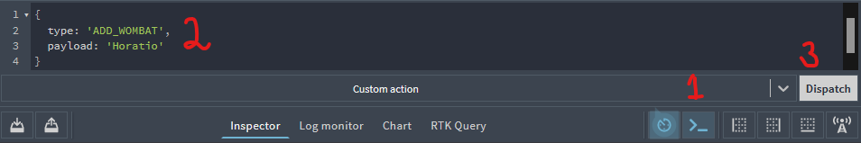

# Redux with React 

This challenge will guide you through building an app to create, update, and delete animals from a list, using Redux to manage application-level state.

## Setup

### 0. Cloning and installation
- [ ] Clone this repo, navigate to it, install packages, and start the server with `npm run dev`
  <details style="padding-left: 2em">
    <summary>Tip</summary>

    ```sh
    cd redux-zoo && npm i
    npm run dev
    ```
  </details>

- [ ] Open [http://localhost:3000](http://localhost:3000) in your browser
- [ ] Open Redux DevTools in your browser
  <details style="padding-left: 2em">
    <summary>More about Redux DevTools</summary>

    The computers on campus should already have the Redux DevTools installed. If you'd like them on your own computer you can install the Firefox add-on [here](https://addons.mozilla.org/en-US/firefox/addon/reduxdevtools/) and the Chrome extension from [here](https://chrome.google.com/webstore/detail/redux-devtools/lmhkpmbekcpmknklioeibfkpmmfibljd).
  </details>

---

## Building up our reducer

### 1. Using Redux DevTools

- [ ] Load up Redux DevTools and dispatch a few `ADD_WOMBAT` and `DEL_WOMBAT` actions to see what's going on
  <details style="padding-left: 2em">
    <summary>Tip</summary>

    You will need to investigate `reducers/wombats.ts` to work out what the payload should be for each of these types
  </details>
  <details style="padding-left: 2em">
    <summary>More about dispatching</summary>

    This screenshot illustrates how to dispatch actions:

    

    1. Select the "Show Dispatcher" button at the very bottom of the dev tools which resembles a command-line prompt (angle bracket followed by an underscore)
    2. In the "Dispatcher" area, supply a Javascript object to be dispatched
    3. Select the "Dispatch" button
  </details>


### 2. Adding to the reducer

- [ ] Add an `UPDATE_WOMBAT` action to the reducer in `reducers/wombats.ts`
  <details style="padding-left: 2em">
    <summary>More about new reducer features</summary>

    Take your time to read through what the reducer currently does, and follow the established pattern to create your new action.

    To update a wombat you will need to provide the **new** name of the wombat (so that it can be changed) but also the **old** name (so that the reducer can find the wombat that needs to be updated). To hold these two data items, your `payload` will need to be an object instead of a string.
  </details>

- [ ] Make sure you can dispatch this new action successfully from Redux DevTools. You'll dispatch it from code in a later step

---

## Building up our components

### 3. Adding a Wombat

- [ ]  So we can add a new wombat, add a form to the page with a single input field and button. (Which component should this form be added to, `<Wombat>` or `<Wombats>`?)
- [ ] Wire up this form so that it can `dispatch` an `ADD_WOMBAT` action to the store to add the wombat's name from the input box

  <details style="padding-left: 2em">
    <summary>More about dispatching from a form</summary>
    
    1. Create a local React state in the component (using `useState`) to hold the new wombat string
    2. Add an `onChange` event handler to the form and update/set this state
    3. Add an event listener to handle the form's `onSubmit` event
    4. Dispatch the action from this `onSubmit` event handler
  </details>

  <details style="padding-left: 2em">
    <summary>Tip</summary>
    
    1. Ensure that you know the shape of the data (string, object, etc) the `ADD_WOMBAT` action needs, and confirm that it works when dispatched from Redux DevTools.
    
    2. Verify that the correct action is being dispatched from your code on the click event. You can see a list of all actions dispatched and inspect them in Redux DevTools.
  </details>

### 4. Deleting a Wombat

Add a delete button next to each of the wombats so they can be deleted:

- [ ] Modify the `<Wombat>` component to add a button next to each of the wombats
- [ ] Add an event listener to handle an `onClick` event
- [ ] In the event listener, dispatch a `DEL_WOMBAT` action to the store to delete the wombat based on its name

  <details style="padding-left: 2em">
    <summary>Tip</summary>
    
    Rather than giving each `<Wombat>` a button, you could alternatively create a form with a single input field. The form's onSubmit event should dispatch `DEL_WOMBAT`.
  </details>

### 5. Updating a Wombat

- [ ] Modify the `<Wombat>` component to add an input box and a button next to each of the wombats
- [ ] Add an event to this new input/button upon submission
  <details style="padding-left: 2em">
    <summary>Tip</summary>
    
    Looking back at your `UPDATE_WOMBAT` action, it expected both the **new** and **old** name of the wombat, so make sure that you can provide both of these values when you dispatch your action.
  </details>
- [ ] `dispatch` the action to the store to change the name of the wombat

---

## Finishing details

### 6. Refactoring your actions

- [ ] Starting with `ADD_WOMBAT`, write a function in `client/actions/index.ts` to **produce** the action: these are called **action creators**.
  <details style="padding-left: 2em">
    <summary>Tip</summary>
    
    Your action creator should return an object with a type and payload. The `ADD_WOMBAT` action expects the name of the new wombat as the payload, so make sure that your function takes the name as a parameter.
  </details>
 - [ ] Import your action creator into the component you dispatch `ADD_WOMBAT` from and use this to replace your action object.
 - [ ] Write and use an action creator for each of your other actions.

### 7. Adding a new reducer

- [ ] Add a new reducer file for another animal. We already have `wombats`; how about `aardvarks`?
- [ ] In `reducers/index.ts`, pass your new reducer file to `combineReducers`
- [ ] Add some actions to the new reducer

### 8. Using the new reducer
- [ ] Make a client-side component (or components) for your new animal

--- 
## Further resources

When you're starting to get happier with this process, you could try reinforcing it with the [Getting Started with Redux](https://egghead.io/courses/getting-started-with-redux) video tutorials from Redux creator Dan Abramov.

## Stretch

<details>
  <summary>More about stretch challenges</summary>

  - Currently our wombats state contains an array of strings, but often our data is stored in database tables and, when retrieved, this comes out as an array of objects. Update your wombat data to match this (perhaps with keys such as `id`, `name`, `furColour`, `favouriteToy`, etc). How does this change the add, delete, and update functionality?
  - Choose a CSS framework to implement and make this page prettier!
  - Write tests for your React components, actions creators, and reducers

</details>

---
[Provide feedback on this repo](https://docs.google.com/forms/d/e/1FAIpQLSfw4FGdWkLwMLlUaNQ8FtP2CTJdGDUv6Xoxrh19zIrJSkvT4Q/viewform?usp=pp_url&entry.1958421517=redux-zoo)
