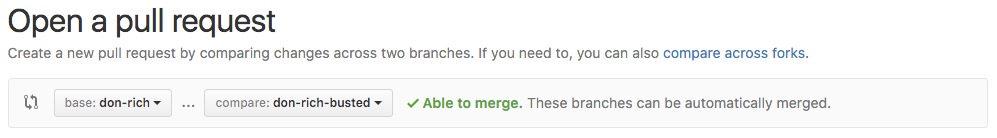

# Two Truths and a Lie

## Summary

Let's get to know each other better, using Git and GitHub! We'll play an icebreaker called Two Truths and a Lie, but instead of sitting around and chatting in person, we're going to use GitHub to chat about what the lie is. **Be sure to read the instructions very carefully as you work through this exercise** and let a teacher know if you need clarifications.


## Release 0: Clone the Repo and Create a Branch

1. Clone this repo. In your browser find the clone URL in the sidebar and copy it. In your terminal, run the following command, replacing `CLONE_URL` with the URL you copied:

  ```shell
  cd ~/workspace
  git clone CLONE_URL
  cd two-truths-and-a-lie
  ```

2. Tell git who is driving: [in person cohort only]

_This step is not required for online students - this is how we credit commits under your name when you're working on an on-campus machine. If you're working on your own machine, you will have configured git globally already._

  ```shell
  git iam DRIVERS_FIRST_NAME
  ```

3. Now we're going to create a branch! To do this we use the `git branch` command. `git branch` on its own lists out all local branches, but when you give it an argument it creates a new branch. A new branch is a copy of the current branch with a different name.

  In your terminal, run the following command, replacing `partner1` and `partner2` with your name and your partner's name in any order you decide:

  ```shell
  git branch partner1-partner2      # e.g. emily-kelly
  git checkout partner1-partner2
  ```

  You could also do this in one step:

  ```shell
  git checkout -b partner1-partner2
  ```
  The result should be one new branch named after your pair.

4. Modify the file `two-truths.md` so that for each of you it contains your name, and three facts about you. One of these facts should be completely made up. You should remove the entries for Neil Armstrong and Buzz Aldrin. 

5. Stage and commit your file to the project with the following commands:

  ```shell
  git add .
  git commit -m "Added truths and lies"
  ```

6. Now push your branch to GitHub with

  ``` shell
  git push origin YourName-PartnersName
  ```
  

## Release 1 : Find the Lie
A teacher will guide you to find the cohort mates with whom you're going to play lie detector. Ask your teacher who you're busting!

1. Pull your cohort mates branch from GitHub into your local repository.

  ```shell
  git fetch
  git checkout THEIR_BRANCH
  ```

2. Create a new branch for your changes

  ```shell
  git checkout -b THEIR_BRANCH-busted
  ```

  * What is the difference between this command and the one in the previous step? 
    * `git --help checkout`

3. Open `two-truths.md` and add the word **LIE** to the line you think is a lie.

4. Stage the changed file and commit it.

  ```shell
  git add two-truths.md
  git commit -m "Found the lie"
  ```

5. Push this branch to GitHub

  ```shell
  git push origin THEIR_BRANCH-busted
  ```

6. Submit a pull request on GitHub of your changes. Be sure the pull request is from `THEIR_BRANCH-busted` into `THEIR_BRANCH` similar to this:

  

  **DO NOT MERGE YOUR PULL REQUEST INTO MAIN!!**

  * Why not? What would happen if everyone merged their branches into `main`?


## Release 2: Come Clean

Now it's time to come clean (or not).

1. Once someone has submitted a LIE pull request on your branch you can comment on the pull request with:

  * "Yep you got it" or
  * "Nope but perhaps you really meant to choose #1" or (if you're devious)
  * "Nope, keep guessing".

  In any case, close the pull request and make sure the target branch is the correct one, **not** `main`.

## Optimize Your Learning

* Draw a diagram of the Git workflows you used in Release 0 and Release 1.
* Describe the workflow using your picture and words (i.e. not code) to your pair or a teacher.
* Make sure you understand all parts _completely_. You will be using this workfow extensively in the next nine weeks. Ask questions if anything is still unclear!

## Resources

* [GitHub Help](https://help.github.com/)
* [Learn Git Branching](http://pcottle.github.io/learnGitBranching/)
* [Git Cheatsheet](http://byte.kde.org/~zrusin/git/git-cheat-sheet-medium.png)
* [Git homepage](https://git-scm.com/)
* [GitHub Hello World](https://guides.github.com/activities/hello-world/)
* [Gitflow Workflow](https://www.atlassian.com/git/tutorials/comparing-workflows/gitflow-workflow)
