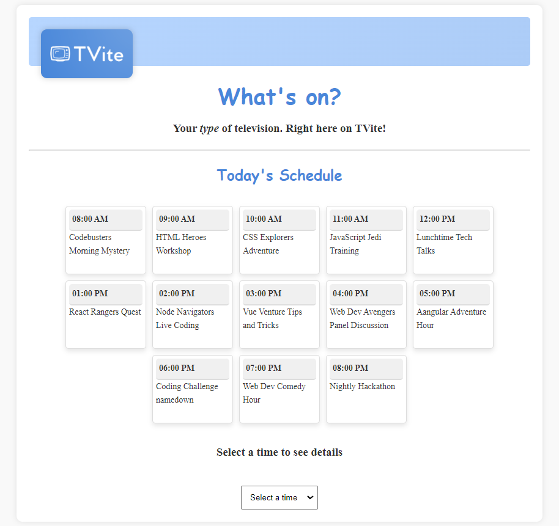

# What's on TVite?

Learning objectives:

1. Use Vite!
1. Practise using Typescript
1. Practise manipulating data

TVite - A one stop shop for all your favourite coding shows, but it is incomplete! The current website only uses placeholder schedule data. We need to establish library functions to load the real data, display it and return the site to it's former useful state!



## Setup

### 0. Cloning and installation

- [ ] After cloning this repo, install dependencies with `npm install`, and start the dev server with `npm run dev`
  <details style="padding-left: 2em">
    <summary>More about getting started</summary>

  - To run the tests: `npm test`. 
  </details>

---

## Things to consider

<details>
  <summary>Important tips for completing the challenge</summary>

1. This challenge uses Vite to load our TypeScript files. Typescript isn't natively supported in browsers, so viewing the HTML file directly in your browser won't work. Instead, use `npm run dev`.
2. Functions in TypeScript should have a defined return type where possible. Give your functions an appropriate type by using `: Type`.
3. The DOM interaction functions have been written for you in this challenge. You will write library functions in the `lib.ts` file to get the website working.
4. When in doubt, check the [TypeScript documentation](https://www.typescriptlang.org/docs/handbook/intro.html) or ask for help!
</details>
<br />

## Requirements

### 1. Getting started

Let's get familiar with the code base so you can begin to understand what needs to be done to get it to work.

- [ ] Firstly, have a look through the code. What is the *shape* of the data in `schedule.ts` and how does this compare to `models/show.ts`?

  <table>
  <tr>
  <th>schedule.ts</th>
  <th>models/show.ts</th>
  </tr>
  <tr>
  <td>
    
  ```ts
  export default [
    {
      time: '08:00 AM',
      name: 'Codebusters Morning Mystery',
      description: 'Join the gang for coding challenges with a Scooby twist.',
    },
    ...
  ]
  ```
    
  </td>
  <td>

  ```ts
  export interface Show {
    time: string
    name: string
    description: string
  }
  ```

  </td>
  </tr>
  </table>
  What other important files can you spot, and what are they for? The `lib.ts` file for example contains the functions you will need, but at this stage they only return placeholders. 

- [ ] If you have the development server running `npm run dev`, you can visit our site at http://localhost:5173. You'll see that a lot of the functionality shows placeholder data. 

- [ ] Notice how there are tests to test the different functions in the lib file. Run our tests with `npm test`, you'll see that initially none of them are passing.

- [ ] Now that you have an idea of what is going on, let's get our lib file set up. Import the schedule and type so that we can access the data later. 
  ```ts
  import schedule from './schedule.ts'

  import {Show} from './models/show.ts'
  ```

### 2. Working on Functions

#### `getTime`

- [ ] Let's starting with the `getTime` function. Consider the `show` parameter and it's type, `Show`. What will the function need to return?

- [ ] Complete the current implementation so that it returns a time for any show. Provide a meaningful TypeScript return type for the function.

  ```typescript
  export function getTime(show: Show): string {
    return show.time
  }
  ```

- [ ] Run the tests with npm test after completing the getShowTimes function to verify if it passes.

### Completion and Verification
After completing each function, run the tests with npm test to confirm that they pass.

Continue this process for the remaining functions in lib.ts.

### Hints

<details>
  <summary>Hints for each of the functions</summary>

  1. For `getShowTimes` and `getShowNames`, consider using a [`.map()`](https://developer.mozilla.org/en-US/docs/Web/JavaScript/Reference/Global_Objects/Array/map). Don't forget to give appropriate types if needed. Bonus points for reusing your getTime and getName functions from earlier!
  2. `getShowByTimeslot` receives a timeslot string as a parameter. use [`.find()`](https://developer.mozilla.org/en-US/docs/Web/JavaScript/Reference/Global_Objects/Array/find) to locate the correct show within the schedule array.
  3. `getNextShowByTimeslot` needs a similar function. Look into [`.findIndex()`](https://developer.mozilla.org/en-US/docs/Web/JavaScript/Reference/Global_Objects/Array/findIndex) and consider how to make use of the result.

</details>
<br />

---

[Provide feedback on this repo](https://docs.google.com/forms/d/e/1FAIpQLSfw4FGdWkLwMLlUaNQ8FtP2CTJdGDUv6Xoxrh19zIrJSkvT4Q/viewform?usp=pp_url&entry.1958421517=whats-on-tvite)
